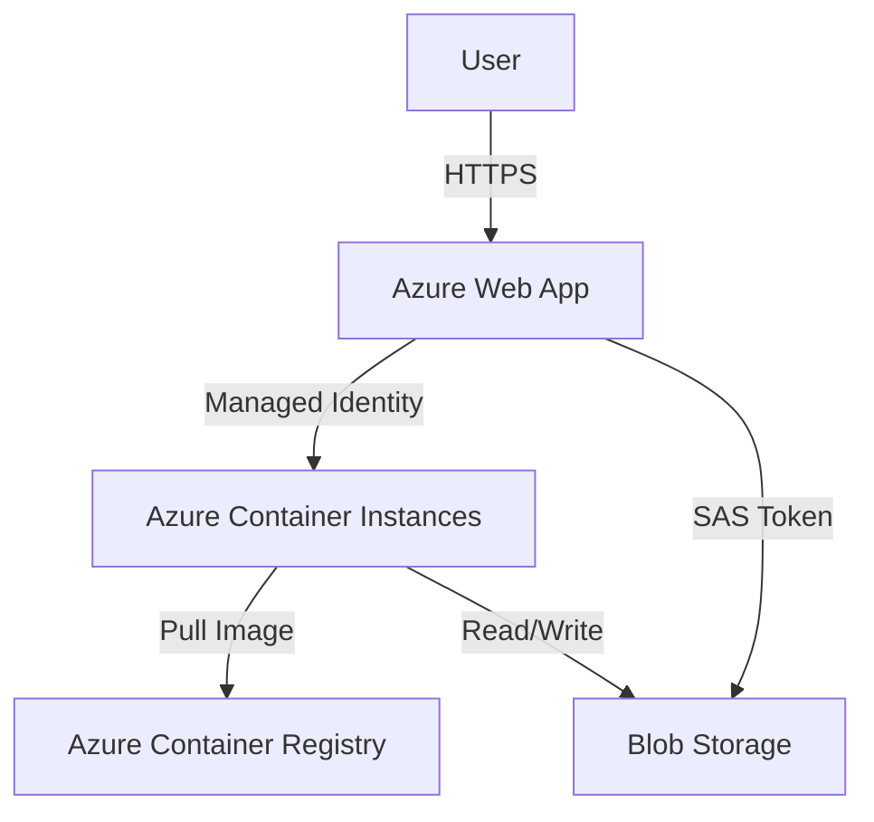

# Geo Cloud Demo

A production-style demo showcasing a distributed ETL and ML pipeline using **C# Minimal API** and **PySpark**.

## Overview

This project demonstrates how to build a scalable data processing pipeline where a lightweight API orchestrates heavy compute jobs. It supports two deployment modes:
1.  **Local Dev**: Uses local Docker or Process for rapid iteration.
2.  **Azure Cloud Native**: Uses **Azure Container Instances (ACI)** for serverless, infinite-scale compute.

- **API Layer**: ASP.NET Core Minimal API (C#) handles file uploads and job management.
- **Compute Layer**: PySpark (Python) performs ETL and KMeans clustering on point-cloud data.
- **Architecture**: Designed to mimic a cloud-native pattern (e.g., API Gateway -> Lambda -> EMR/Databricks).

See [Architecture Docs](docs/Architecture.md) for details.

## Prerequisites

- **.NET 9 SDK**: For the API.
- **Python 3.8+**: For the Spark job.
- **Java 8+**: Required for Apache Spark.
- **uv** (Optional but recommended): For Python dependency management.

## CI/CD Pipeline

The project includes a GitHub Actions workflow (`.github/workflows/deploy.yml`) that automatically:
1.  **Builds** Docker images for the API and PySpark worker.
2.  **Pushes** them to Azure Container Registry (ACR).
3.  **Deploys** the latest code to the Azure Web App (if Continuous Deployment is enabled).

**Trigger**: Push to `master`.

## Project Structure

```
/api            # C# ASP.NET Core Minimal API
/geo-spark-ml   # PySpark ETL & ML project
/docs           # Architecture documentation
```

## How to Run End-to-End

### 1. Setup Python Environment

Navigate to `geo-spark-ml` and install dependencies.

```powershell
cd geo-spark-ml
# Using uv (Recommended)
uv sync
# OR using pip
pip install .
```

### 2. Start the API

Open a new terminal in the `api` folder.

**Important:** Ensure your Python environment is active or `python` is in your PATH with `pyspark` installed.
If using `uv`, you might want to activate the virtual environment first:
```powershell
# From geo-spark-ml folder
.venv\Scripts\activate
```

Then run the API:
```powershell
cd ../api
dotnet run
```
The API will start (usually at `http://localhost:5000` or similar). Note the port.

### 3. Submit a Job

Use `curl` or Postman to upload a CSV file.

**Sample CSV Format (`sample.csv`):**
```csv
x,y,z,intensity
1.0,2.0,3.0,0.5
1.1,2.1,3.1,0.6
10.0,10.0,10.0,0.9
...
```

**Upload Command:**
```powershell
# Replace PORT with your running port
curl -X POST -F "file=@path/to/your/sample.csv" http://localhost:5000/upload
```

Response:
```json
{
  "jobId": "guid-1234...",
  "status": "Queued"
}
```

### 4. Check Status & Results

Poll the status using the `jobId` from the previous step.

```powershell
curl http://localhost:5000/result/guid-1234...
```

Response (when complete):
```json
{
  "jobId": "guid-1234...",
  "status": "Completed",
  "resultPath": "E:\\Trae_projs\\geo-cloud-demo\\api\\outputs\\guid-1234...",
  "error": null,
  "createdAt": "..."
}
```

Check the `resultPath` for the processed CSV files.

## Development

- **C# API**: Located in `api/`. Run with `dotnet run`.
- **PySpark**: Located in `geo-spark-ml/`. Run manually with:
  ```powershell
  python -m geo_clustering.main --input data/sample.csv --output output/test_run
  ```

## Deployment Modes

### Mode 1: Local Docker (Simulation)
Simulates isolation. The API spawns a local Docker container.
1.  **Build Image**: `docker build -t geo-spark-ml:latest ./geo-spark-ml`
2.  **Config**: Set `"UseDocker": true` in `api/appsettings.json`.
3.  **Run**: `dotnet run` in `api/`.

### Mode 2: Azure Cloud Native (Production)
The full cloud architecture. The API (Web App) spawns Azure Container Instances (ACI).

**Prerequisites:**
*   Azure Subscription & Resource Group.
*   **ACR**: Azure Container Registry with the `geo-spark-ml` image pushed.
*   **Managed Identity**: User Assigned Identity for the ACI worker.

**Configuration (`api/appsettings.json`):**
```json
"UseDocker": true,
"Azure": {
  "SubscriptionId": "...",
  "ResourceGroup": "rg-geospark-demo",
  "ManagedIdentityName": "id-geospark-worker",
  "ContainerRegistry": { "LoginServer": "...", "ImageName": "..." },
  "Storage": { "AccountName": "..." }
}
```

**Architecture Flow:**
1.  **Upload**: User uploads file -> Web App -> Blob Storage.
2.  **Trigger**: Web App uses `ArmClient` to create an ACI Group (`job-guid`).
3.  **Compute**: ACI pulls image from ACR (using Managed Identity), processes Blob data, writes results back to Blob.
4.  **Result**: Web App generates a SAS Token for the user to download results.

## Azure Resources Structure

The project is deployed to a single Resource Group `rg-geospark-demo` in `Australia East`.



### Resource Hierarchy

```text
1. 🏢 Subscription
   ID: c3f5be8c...
   │
   └── 2. 📂 Resource Group
       Name: rg-geospark-demo
       Region: Australia East
       │
       │   [Azure Resources]
       │
       ├── 3A. 🌐 Web App (Orchestrator - Long Running)
       │       Name: geospark-webapp-lh
       │       Url: ...azurewebsites.net
       │       (Containerized API, runs 24/7 to handle requests)
       │
       ├── 3B. 🏭 ACR (Container Registry)
       │       Name: geosparkmlacr
       │       │
       │       └── 4. Docker Image
       │              Tag: geo-spark-ml:latest
       │
       ├── 3C. 💾 Storage Account
       │       Name: geosparkstorelh
       │       │
       │       └── 4. Blob Container
       │              Name: job-data
       │
       └── 3D. ⚡ ACI (Worker - Dynamic)
               Name: job-{guid}
               (Created on demand, deleted after completion)
```

### Resource Inventory
*   **Web App**: `geospark-webapp-lh` (The API Orchestrator)
*   **ACR**: `geosparkmlacr` (Stores `geo-spark-ml` image)
*   **Storage**: `geosparkstorelh` (Container: `job-data`)
*   **Identity**: `id-geospark-worker` (User Assigned Identity for ACI)

For a deep dive into the migration journey and troubleshooting, see [Project Learning Notes](learning/project_learning_notes.md).
