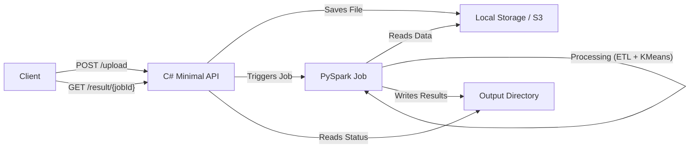

# Architecture

This project demonstrates a cloud-native style ETL and ML pipeline using a C# Minimal API as the orchestration layer and PySpark as the compute engine.

## High-Level Overview

## Components

### 1. C# Minimal API (`/api`)
- **Role**: Orchestrator and Interface.
- **Responsibilities**:
  - Accepts file uploads (simulating S3 upload).
  - Queues background jobs.
  - Triggers the PySpark process.
  - Exposes job status and results.
- **Scalability**: In a real cloud environment, this would push messages to a queue (SQS/Service Bus), and a worker (Lambda/Azure Function) would trigger the Spark job (Databricks/EMR).

### 2. PySpark Pipeline (`/geo-spark-ml`)
- **Role**: Compute Engine.
- **Responsibilities**:
  - Reads input data (CSV).
  - Performs ETL (cleaning, feature engineering).
  - Runs MLlib KMeans clustering.
  - Writes results to disk.
- **Scalability**: Spark is designed for distributed computing. This code can run on a single machine (local mode) or a cluster (Databricks, EMR, HDInsight) without code changes.

## Data Flow

1.  **Ingestion**: User uploads a CSV file with point cloud data (`x`, `y`, `z`, `intensity`).
2.  **Storage**: File is saved to a temporary location (simulating a Data Lake landing zone).
3.  **Processing**:
    -   API triggers a **Docker Container** (or local process) running PySpark.
    -   Spark reads the CSV.
    -   **Feature Engineering**: Calculates magnitude (distance from origin).
    -   **Clustering**: Groups points into 3 clusters using KMeans based on spatial coordinates and magnitude.
    -   **Metrics**: Calculates Silhouette Score and saves to `metrics.json`.
4.  **Output**: Results (CSV) and Metrics (JSON) are written to a structured output directory.

## Cloud Mapping

| Local Component | AWS Equivalent | Azure Equivalent |
|-----------------|----------------|------------------|
| C# API          | API Gateway + Lambda | App Service / Functions |
| Local Storage   | S3 Bucket      | ADLS Gen2 / Blob Storage |
| PySpark Job     | EMR / Glue     | **ACI (This Demo)** / Databricks |
| Job Queue       | SQS            | Service Bus / Storage Queue |

## Directory Structure

- `api/`: ASP.NET Core Web API project.
- `geo-spark-ml/`: Python project containing the Spark logic.
- `docs/`: Documentation and diagrams.
